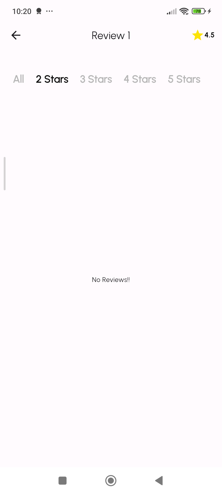
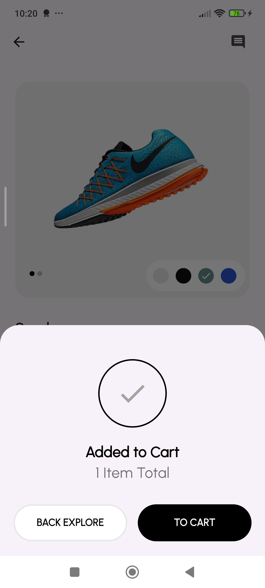

# **Shoesly: Your Ultimate Sneaker Marketplace**

Shoesly is a cutting-edge Flutter-based e-commerce platform, meticulously designed to cater to the sneaker enthusiast community. Explore, discover, and purchase the latest and most sought-after sneaker releases, all within a seamless, user-friendly mobile experience.

# **Project GitHub Repository:** 


[](https://github.com/Rk-Thakur/Shoesly)


# **Generated project structure:**

```bash
your_project/
|-- packages/
| |-- AppName/
| | |-- lib/
| | |-- test/
| | |-- pubspec.yaml
| |-- AppName_components/
| | |-- lib/
| | |-- pubspec.yaml
| |-- AppName_core/
| | |-- lib/
| | |-- pubspec.yaml
| |-- AppName /
| | |-- lib/
| | |-- pubspec.yaml
|-- melos.yaml
|-- pubspec.yaml
|-- ...
```


## **Documentation**
[Documentation](https://docs.google.com/document/d/16LrEJ_zYHaXfD0N90GaUsxgsa-BI9nMPTnapwoXAZKM/edit?usp=sharing)


## **Tech Stack**

* **Flutter:** Cross-platform UI framework for iOS and Android
* **Dart:** Powerful programming language for building scalable apps
* **Melos:** Monorepo management tool for Flutter projects
* **Firebase:** Backend-as-a-Service for authentication, database, and cloud functions
* **State Management:** BLOC for efficient app state management


## **Monorepo Setup (Melos)**

1. **Install Melos:** Make sure Melos is installed globally (`dart pub global activate melos`).
2. **Bootstrap:** Run `melos bootstrap` has been added to the root directory to fetch dependencies for all packages.
3. **Execute Commands:** Execute commands across all packages using `melos exec -- <command>`.
    
    **General Commands:**

   * `melos exec -- <command>`: Runs the specified command in all packages. (e.g., `melos exec -- flutter analyze`)
   * `melos exec --scope=<package_name> <command>`: Runs the command only in the specified package. (e.g., `melos exec --scope=mobile flutter run`)

   **Commonly Used code for the projects**

   * `melos bootstrap/bs`: Fetch dependencies for all packages.
   * `melos run svg `: Run to generate the svg image to vector images
   * `melos run analyze `: Run to analyze the dart code
   * `melos run  clean`:  Cleans build outputs for all packages.

## **SonarQube Integration (Local Server)**

To ensure code quality and maintainability, we've integrated SonarQube into our development workflow. Follow these steps to set up a local SonarQube server and analyze your Flutter code:

1. **Download and Install:** Get SonarQube Community Edition and follow the installation instructions.
2. **Start Server:** Launch the SonarQube server.
3. **Install SonarScanner:** Download and set up the SonarScanner tool.
4. **Project Configuration:** A `sonar-project.properties` file has been created on the shoesly directory and configure it with your SonarQube server URL and project details.
5. **Code Analysis:** Run the SonarScanner to analyze your code and upload the results to SonarQube.

**For detailed instructions and troubleshooting, refer to the official SonarQube documentation:**

https://docs.sonarqube.org/latest/setup/installing-sonarqube/

**For the setup:**

https://medium.com/@meaghosh/static-code-analysis-with-sonarqube-with-flutter-11a74beb9950
https://medium.com/@rohitsuhag7/setup-sonarqube-locally-for-flutter-on-mac-2db922f1f9d3
## 🔗 Links
[](https://flowcv.me/rkthakur)
[](https://www.linkedin.com/in/ranjan-thakur-440a921aa/)


# **Project Installation**

**Clone the repository**


```bash
    git clone https://github.com/Rk-Thakur/Shoesly/tree/shoesly
```

**Global Activate Melos**

```bash
    dart pub global activate melos
```

**Melos Bootstrap: for pub get**

```bash
    melos bs
```

**Melos Bootstrap: for changing svg to vectorimage**

```bash
    melos run svg  
```

**Run the project**

```bash
    path_to_shoely_folder/main.dart

    flutter run 
 ```


## Screenshots








